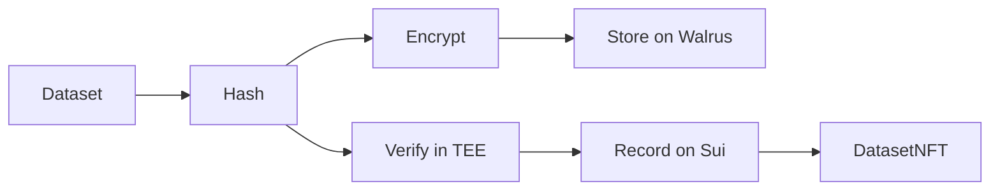

# SealTrust

**Cryptographic Verification and Encrypted Storage for AI Training Datasets**

Built on Sui | Walrus | Seal | Nautilus TEE

**Trust. Encrypt. Verify.**

---

## The Problem

AI training datasets lack provenance. When you need to prove:
- **When** a dataset existed (research priority, legal disputes)
- **If** the data has been tampered with (integrity verification)
- **Who** can access it (privacy compliance)

There's no standardized solution. Centralized timestamps can be forged. Cloud storage can be modified. Access control is fragmented.

## The Solution

SealTrust creates permanent, unforgeable records on the Sui blockchain with encrypted storage and hardware-attested verification.

## How It Works

| Step | What Happens | Technology |
|------|--------------|------------|
| 1 | Hash the original file | SHA-256 |
| 2 | Encrypt with access control | Seal |
| 3 | Store encrypted blob | Walrus |
| 4 | Verify metadata in secure hardware | Nautilus TEE |
| 5 | Record proof on blockchain | Sui |
| 6 | Authorized users decrypt | Session Keys |

## Repositories

| Repository | Description |
|------------|-------------|
| [sealtrust-frontend](https://github.com/Seal-Trust/sealtrust-frontend) | Next.js web application |
| [sealtrust-contracts](https://github.com/Seal-Trust/sealtrust-contracts) | Sui Move smart contracts |
| [sealtrust-enclave](https://github.com/Seal-Trust/sealtrust-enclave) | Nautilus TEE verification service |

## Deployed Contracts (Sui Testnet)

| Contract | Address | Explorer |
|----------|---------|----------|
| SealTrust Verification | `0xcdc25c90e328f2905c97c01e90424395dd7b10e67769fc8f4ae62b87f1e63e4e` | [View](https://testnet.suivision.xyz/package/0xcdc25c90e328f2905c97c01e90424395dd7b10e67769fc8f4ae62b87f1e63e4e) |
| Seal Allowlist | `0x705937d7b0ffc7c37aa23a445ed52ae521a47adcdffa27fe965e0b73464a9925` | [View](https://testnet.suivision.xyz/package/0x705937d7b0ffc7c37aa23a445ed52ae521a47adcdffa27fe965e0b73464a9925) |
| Enclave Config | `0x55d6a15a5e8822b39f76dc53031d83beddc1e5b0e3ef804b82e8d4bfe4fbdc32` | [View](https://testnet.suivision.xyz/object/0x55d6a15a5e8822b39f76dc53031d83beddc1e5b0e3ef804b82e8d4bfe4fbdc32) |
| Enclave | `0x611b83f2b4d97471a6c164877ff23a2f0570806baf3d9380d1f11433a2b685ec` | [View](https://testnet.suivision.xyz/object/0x611b83f2b4d97471a6c164877ff23a2f0570806baf3d9380d1f11433a2b685ec) |

## Live Services

| Service | URL |
|---------|-----|
| Nautilus TEE | `https://nautilus.sealtrust.app` |

## Tech Stack

Sui Blockchain

Layer 1 blockchain for immutable DatasetNFT records. Each registration creates an NFT with:
- Original file hash
- Walrus blob ID
- Seal policy ID
- TEE attestation signature
- Timestamp

Walrus

Decentralized blob storage. Encrypted datasets are split across the network. No single entity controls your data.

Seal

Threshold encryption with on-chain access control. 2-of-6 key servers must approve decryption. Access is governed by allowlists on Sui.

Nautilus TEE

AWS Nitro Enclave for hardware-attested verification. Even AWS cannot access the verification code. Provides cryptographic proof that metadata was verified in secure hardware.

